# Library Management

This is a simple library management system implemented in Python Flask, Bootstrap CSS and Colorlib admin dashboard template. The application allows users to borrow and return books, keeps track of borrowed books and more.

## Setup

### Environment Variables

Before running the application, make sure to set the environment variable for the database URI. You can use a free database like Supabase.

```bash
DB=<your_database_uri-postgresql>
ALLOW_UP=True or Flase
```

- DB = Is for your database uri
- ALLOW_UP = Is it allow for update password

## Common Error

1. When you deploy this application, if you are using postgres database you may meet this problem:

```
sqlalchemy.exc.NoSuchModuleError: Can't load plugin: sqlalchemy.dialects:postgres
```

### Way to Solve

- You can try to change ```postgres://``` to ```postgresql://```.
- ref: https://stackoverflow.com/questions/62688256/sqlalchemy-exc-nosuchmoduleerror-cant-load-plugin-sqlalchemy-dialectspostgre


2. **In Production** sometimes you may get **Internal Server Error (http:500)**, It Basically is this error:

```
sqlalchemy.exc.OperationalError: (psycopg2.OperationalError) SSL connection has been closed unexpectedly
```
### Way to Solve

- You may just **refresh** the page and try again. 
- You can also **change another database provider.**

### Docker

You can also run the application using Docker.

```bash
docker pull jiale0709/library-management
```

## Deploy
Here is the free instance that can host this app with (Docker)
- [Render](https://render.com)
- [Koyeb](https://koyeb.com)

## Features
- **Get Started Page**: Basic initialize process to craete admin account.
- **Admin-auth System**: Basic Admin login System
- **Member System**: Create Member to any amount as many as you have.
- **Book Record System**: Create Book record to any amount as many as you have.
- **Borrow Books**: Users can borrow books by providing the book's barcode.
- **Return Books**: Users can return borrowed books.

## ScreenShoot
1. Get Started & Authentication


2. Books
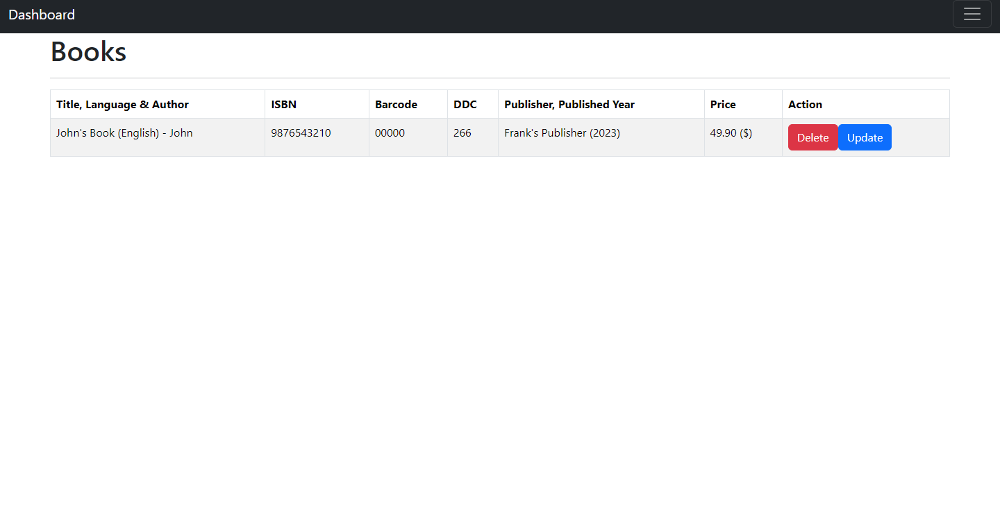
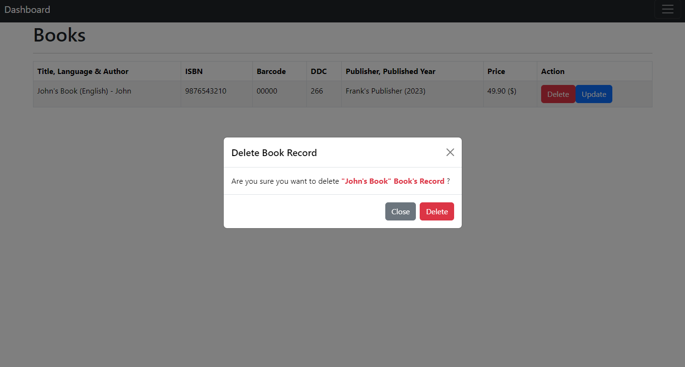
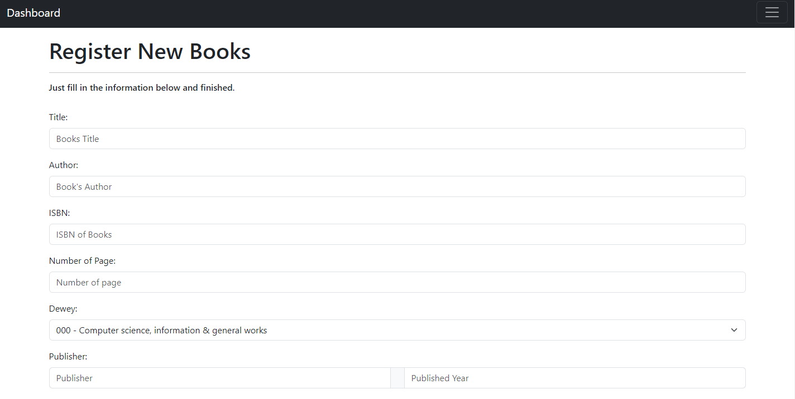
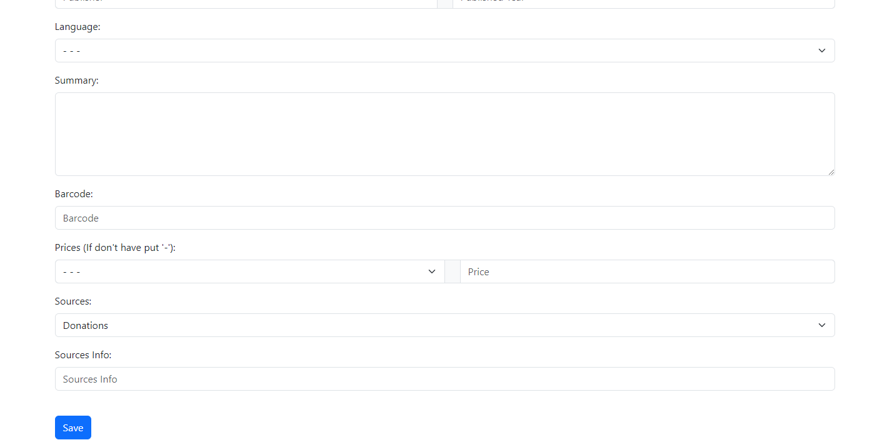
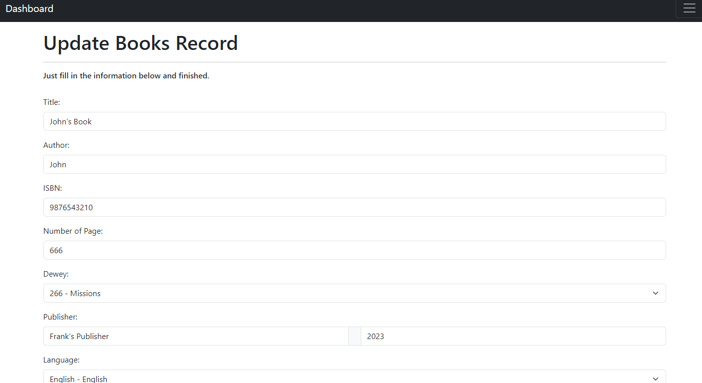

3. Borrow Books
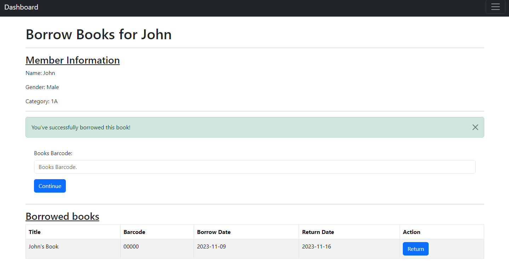
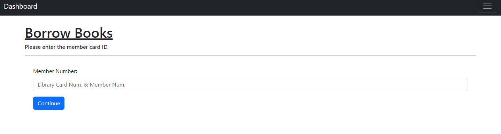
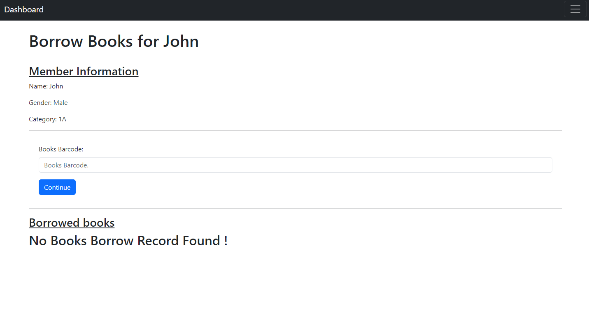

4. Member
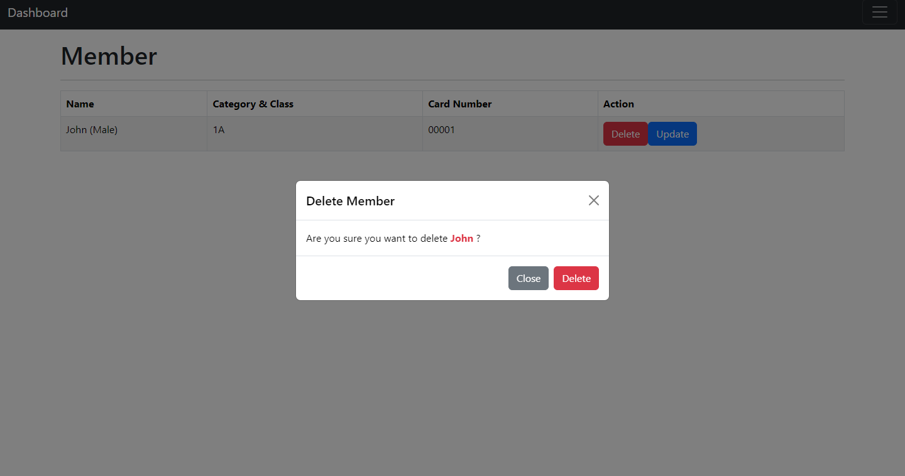
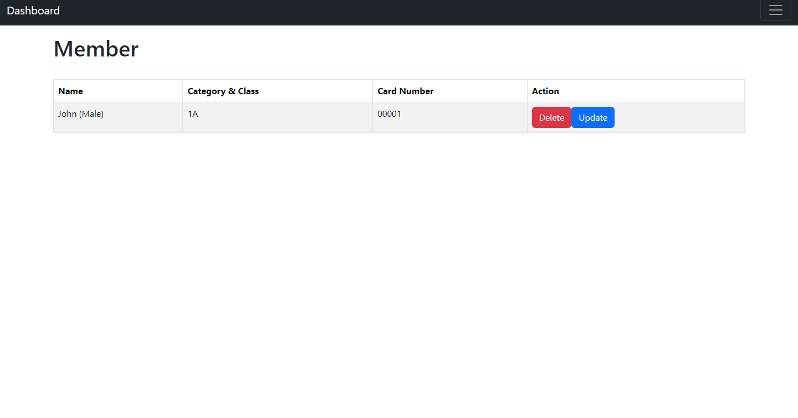
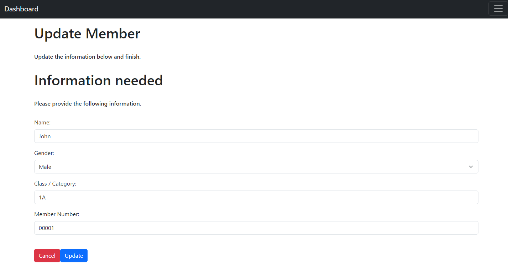
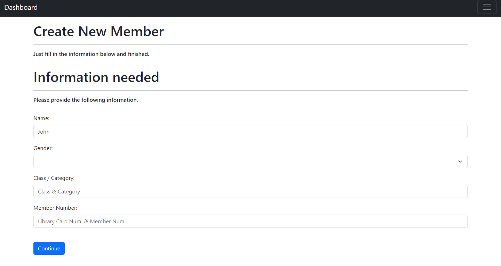

5. Return Books
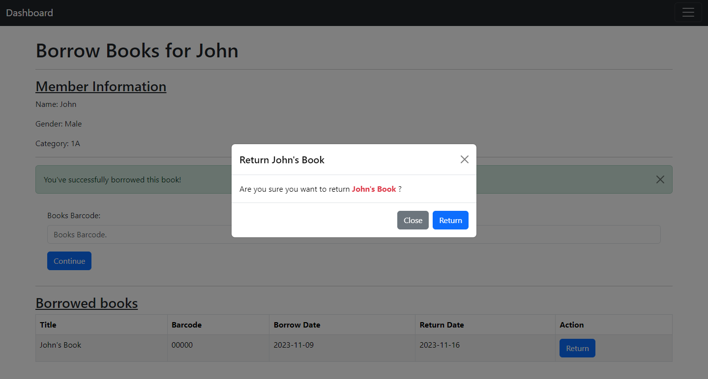


## Usage

1. Clone the repository.

```bash
git clone https://github.com/jiale0709/library-management.git
cd library-management
```

2. Install dependencies.

```bash
pip install -r requirements.txt
```

3. Set the environment variable for the database URI.

```bash
DB=<your_database_uri-postgresql>
ALLOW_UP=True or Flase
```

- DB = Is for your database uri
- ALLOW_UP = Is it allow for update password

4. Run the Flask application.

```bash
python app.py
```

5. Access the application in your browser at `http://localhost:5000`.

## Contributing

Feel free to contribute to the project by opening issues or submitting pull requests. Your feedback and suggestions are always welcome!

## License

This project is licensed under the MIT License - see the [LICENSE](LICENSE) file for details.

## Todo
1. Graph UI to show the analytics.