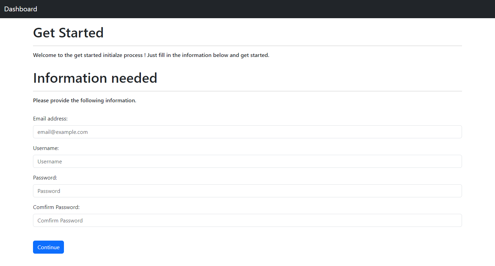

# Library Management

This is a simple library management system implemented in Python Flask and Bootstrap CSS. The application allows users to borrow and return books, keeps track of borrowed books and more.

## Setup

### Environment Variables

Before running the application, make sure to set the environment variable for the database URI. You can use a free database like Supabase.

```bash
export DB=<your_database_uri>
```

### Docker

You can also run the application using Docker.

```bash
docker pull jiale0709/library-management
```

## Deploy
Here is the free instance that can host this app with (Docker)
- [Render](render.com)
- [Koyeb](koyeb.com)

## Features
- **Get Started Page**: Basic initialize process to craete admin account.
- **Admin-auth System**: Basic Admin login System
- **Member System**: Create Member to any amount as many as you have.
- **Book Record System**: Create Book record to any amount as many as you have.
- **Borrow Books**: Users can borrow books by providing the book's barcode.
- **Return Books**: Users can return borrowed books.

## ScreenShoot
1. Get Started


2. Books


3. Borrow Books


4. Member


5. Return Books


## Usage

1. Clone the repository.

```bash
git clone https://github.com/jiale0709/library-management.git
cd library-management
```

2. Install dependencies.

```bash
pip install -r requirements.txt
```

3. Set the environment variable for the database URI.

```bash
export DB=<your_database_uri>
```

4. Run the Flask application.

```bash
python app.py
```

5. Access the application in your browser at `http://localhost:5000`.

## Contributing

Feel free to contribute to the project by opening issues or submitting pull requests. Your feedback and suggestions are always welcome!

## License

This project is licensed under the MIT License - see the [LICENSE](LICENSE) file for details.

## Todo
1. Add UI in dashboard home page.
2. Graph UI to show the analytics.
